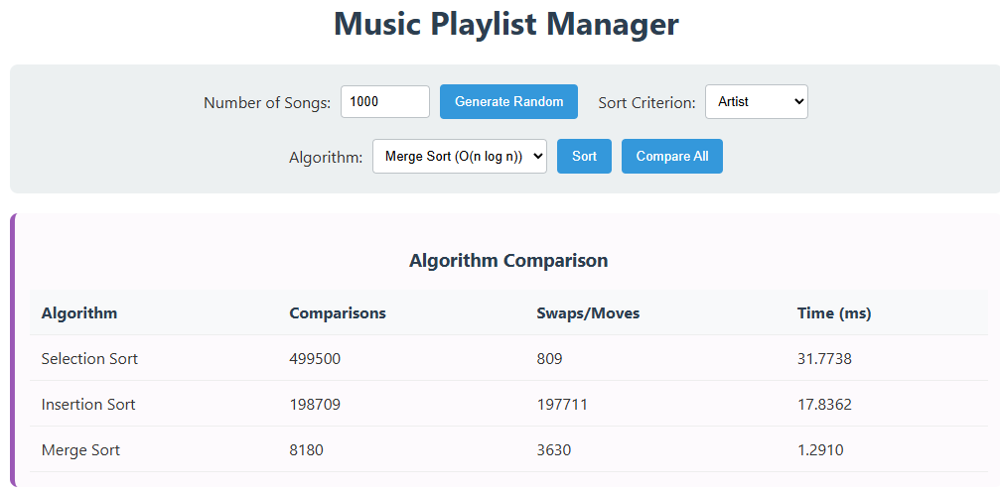

# Week 03 Assignment: Music Playlist Manager Report

**Course:** Algorithm  
**Department:** Dept. of Computer Science & Software Engineering  
**Name:** 2021270607 | Oh Se Jun  

---

## 1. Application Screenshot
*Below is the screenshot of the Music Playlist Manager after performing a sort operation.*

---

## 2. Performance Comparison Table
*Comparative analysis of sorting algorithms based on input size (N) using the **Play Count** criterion.*

| **Input Size (N)** | **Algorithm** | **Comparisons** | **Swaps / Moves** | **Execution Time** |
| :---: | :--- | :---: | :---: | :---: |
| **100** | 🔹 Selection | 4,950 | 95 | 0.2990 ms |
| | ✔️ Insertion | 2,178 | 2,079 | 0.1832 ms |
| | 🚀 **Merge** | **531** | **263** | **0.1011 ms** |
| | | | | |
| **1,000** | 🔹 Selection | 499,500 | 809 | 31.7738 ms |
| | ✔️ Insertion | 198,709 | 197,711 | 17.8362 ms |
| | 🚀 **Merge** | **8,180** | **3,630** | **1.2910 ms** |
| | | | | |
| **5,000** | 🔹 Selection | 12,497,500 | 4,992 | 793.5033 ms |
| | ✔️ Insertion | 5,880,627 | 5,875,632 | 603.5610 ms |
| | 🚀 **Merge** | **53,746** | **26,193** | **8.6269 ms** |

---

## 3. Analysis & Discussion

### 3.1 Which algorithm was the fastest? Why?
**Merge Sort** was significantly faster than Selection Sort and Insertion Sort, especially as the input size **N** increased. 
- **Reason:** Merge Sort has a worst-case time complexity of **O(nlog n)**, whereas Selection and Insertion Sort have **O(n^2)**. For N=5,000, n^2 is 25,000,000, while n \log n is approximately 61,000. This mathematical difference explains the drastic gap in execution time as the data scales.

### 3.2 When would **O(n^2)** algorithms still be acceptable?
**O(n^2)** algorithms like Selection or Insertion Sort can be acceptable in the following scenarios:
1. **Small Data Sets:** When **N** is very small (e.g., N < 50), the constant factors of more complex algorithms like Merge Sort might make them slower or not worth the implementation overhead.
2. **Nearly Sorted Data (Insertion Sort):** Insertion Sort is very efficient (**O(n)**) when the list is already almost sorted. It is often used in practice to "finish off" sorting in hybrid algorithms like Timsort.
3. **Memory Constraints:** Selection Sort and Insertion Sort are **in-place** algorithms, meaning they require **O(1)** extra space. Merge Sort typically requires **O(n)** extra space to store the divided subarrays, which might be a problem in memory-constrained environments.

---
