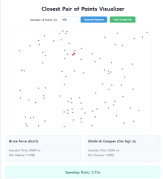

# Week 04 Assignment: Closest Pair of Points Visualizer

**Name:** 오세준  
**Student ID:** 2021270607  
**Date:** 2026-04-06

---

## 1. Introduction
본 과제는 평면 상의 **n**개의 점들 중 가장 가까운 두 점의 쌍을 찾는 문제를 해결하고, 이를 시각화하는 웹 애플리케이션을 구현하였습니다. 특히 단순 탐색(Brute Force) 방식과 분할 정복(Divide and Conquer) 방식의 성능을 비교하여 알고리즘의 효율성을 분석하였습니다.

## 2. Algorithm Implementation

### 2.1 Brute Force Approach
- 모든 점의 쌍 **(n(n-1)/2**개)에 대해 거리를 계산하여 최솟값을 찾습니다.
- 시간 복잡도: **O(n^2)**

### 2.2 Divide & Conquer Approach
- **Step 1:** 점들을 **x**좌표 기준으로 정렬합니다.
- **Step 2:** 평면을 왼쪽과 오른쪽 절반으로 나눕니다.
- **Step 3:** 각 절반에 대해 재귀적으로 최근접 거리를 찾습니다 (**d = \min(d_L, d_R)**).
- **Step 4 (Strip Check):** 두 영역의 경계선 근처(거리 **d** 이내)에 있는 점들을 **y**좌표 기준으로 정렬하여 검사합니다.
- 시간 복잡도: **O(n \log^2 n)** (또는 **y**정렬 최적화 시 **O(n \log n)**)

---

## 3. Results & Performance Analysis

### 3.1 Application Screenshot

### 3.2 Performance Table
다양한 점의 개수(**n**)에 따른 두 알고리즘의 실행 시간 비교 결과입니다.

| Number of Points (n) | Brute Force Time (ms) | Divide & Conquer Time (ms) | Speedup Ratio |
|----------------------|-----------------------|----------------------------|---------------|
| 100 points           | [ 2.9064 ] ms         | [ 0.5641 ] ms              | [ 5.15 ] x    |
| 1,000 points         | [ 198.9412 ] ms       | [ 4.1497 ] ms              | [ 47.94 ] x   |
| 5,000 points         | [ 4849.2448 ] ms      | [ 23.9935 ] ms             | [ 202.11 ] x  |

---

## 4. Discussion

### 4.1 Efficiency of Divide & Conquer
분할 정복 방식은 전체 문제를 더 작은 부분 문제로 나누어 해결함으로써 탐색 범위를 획기적으로 줄입니다. **n=5,000**일 때, Brute Force는 약 1,250만 번의 거리 계산이 필요하지만, 분할 정복은 재귀적인 구조를 통해 필요한 계산량을 로그 스케일로 감소시킵니다.

### 4.2 Why Checking Only the "Strip" is Sufficient?
경계선 근처의 'Strip' 영역에서만 추가 검사를 하는 이유는, 이미 왼쪽과 오른쪽 각 영역 내의 최근접 거리가 **d**임을 알고 있기 때문입니다. 만약 영역을 가로지르는 두 점의 거리가 **d**보다 작으려면, 두 점 모두 경계선으로부터 **x**축 방향으로 **d** 이내에 있어야만 합니다. 또한, **y**좌표 기준으로 정렬된 Strip 내의 점들을 검사할 때도, 특정 점 주변의 일정한 개수(최대 7개)의 점들만 확인하면 된다는 수학적 증명이 존재하므로 **O(n)** 시간에 처리가 가능합니다.

---

## 5. Conclusion
실험 결과 점의 개수가 많아질수록 분할 정복 알고리즘의 성능 우위가 뚜렷하게 나타났습니다. 이는 기하 알고리즘에서 적절한 분할 전략이 성능 최적화에 얼마나 중요한 역할을 하는지 보여줍니다.
