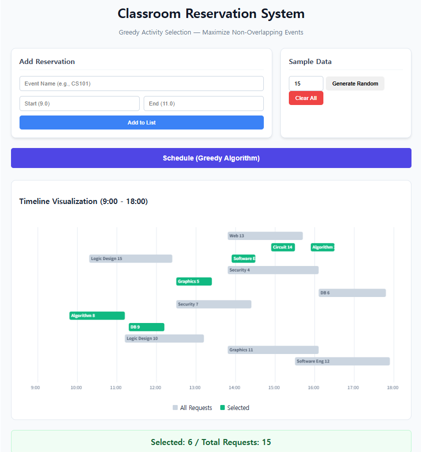

## Week 05 Assignment: Classroom Reservation System
## 1. Introduction
본 과제는 탐욕 알고리즘(Greedy Algorithm)의 대표적인 사례인 활동 선택 문제(Activity Selection Problem)를 활용하여, 한 강의실에서 가장 많은 수의 수업이나 행사를 배정할 수 있는 예약 시스템을 구현하였습니다. 겹치지 않는 최대 활동 집합을 찾는 최적화 과정을 시각화하고 분석하였습니다.
## 2. Algorithm Implementation
### 2.1 Greedy Activity Selection
- **Input:** **n**개의 예약 요청 (각 요청은 시작 시간 **s_i**와 종료 시간 **f_i**를 가짐)
- **Strategy:** 종료 시간(**f_i**)을 기준으로 오름차순 정렬한 뒤, 이전 선택된 활동의 종료 시간보다 시작 시간이 늦거나 같은 활동을 순차적으로 선택합니다.
- **Complexity:** 정렬에 **O(n \log n)**, 탐색에 **O(n)**이 소요되어 전체 시간 복잡도는 **O(n \log n)**입니다.
---
## 3. Results & Step-by-Step Trace
### 3.1 Application Screenshot

### 3.2 Step-by-Step Trace
| Order | Event Name | Interval | Status | Reason |
|:---:|:---|:---:|:---:|:---|
| 1 | Algorithm 8 | 9.8-11.2 | Selected | First activity |
| 2 | DB 9 | 11.3-12.2 | Selected | 11.3 >= 11.2 |
| 3 | Logic Design 15 | 10.3-12.4 | Rejected | Overlaps DB 9 (10.3 < 12.2) |
| 4 | Logic Design 10 | 11.2-13.2 | Rejected | Overlaps DB 9 (11.2 < 12.2) |
| 5 | Graphics 5 | 12.5-13.4 | Selected | 12.5 >= 12.2 |
| 6 | Security 7 | 12.5-14.4 | Rejected | Overlaps Graphics 5 (12.5 < 13.4) |
| 7 | Software Eng 3 | 13.9-14.5 | Selected | 13.9 >= 13.4 |
| 8 | Web 13 | 13.8-15.5 | Rejected | Overlaps SE 3 (13.8 < 14.5) |
| 9 | Circuit 14 | 14.9-15.5 | Selected | 14.9 >= 14.5 |
| 10 | Web 1 | 14.9-15.7 | Rejected | Overlaps Circuit 14 (14.9 < 15.5) |
| 11 | Security 4 | 13.8-16.1 | Rejected | Overlaps Circuit 14 (13.8 < 15.5) |
| 12 | Graphics 11 | 13.8-16.1 | Rejected | Overlaps Circuit 14 (13.8 < 15.5) |
| 13 | Algorithm 2 | 15.9-16.5 | Selected | 15.9 >= 15.5 |
| 14 | DB 6 | 16.1-17.8 | Rejected | Overlaps Algorithm 2 (16.1 < 16.5) |
| 15 | Software Eng 12 | 15.5-17.9 | Rejected | Overlaps Algorithm 2 (15.5 < 16.5) |
---
## 4. Analysis
종료 시간이 가장 이른 활동을 먼저 선택하는 것은 **"강의실을 가능한 한 빨리 비워줌으로써 이후에 올 수 있는 활동들에게 최대한 많은 시간을 할애해주는"** 전략이기 때문입니다. 수학적으로는, 만약 최적해(Optimal Solution)가 가장 빨리 끝나는 활동을 포함하지 않는다면, 그 해의 첫 활동을 가장 빨리 끝나는 활동으로 교체해도 여전히 유효하고(Valid) 크기가 같은 최적해를 유지할 수 있다는 교체 논증(Exchange Argument)을 통해 증명 가능합니다.

- **Sorting by Start Time:** 일찍 시작해도 아주 늦게 끝나는 활동(예: 9:00-18:00)이 먼저 선택될 수 있어 최적해를 보장하지 못합니다.
- **Sorting by Duration (Shortest First):** 매우 짧은 활동이 두 활동의 경계에 걸쳐 있을 경우, 그 한 개를 선택하느라 양쪽의 두 개를 놓칠 수 있어 최적해를 보장하지 못합니다.
---

## 5. Conclusion
실험 결과, 종료 시간 기준의 탐욕 선택 속성(Greedy Choice Property)을 통해 최대 개수의 활동을 효율적으로 배정할 수 있음을 확인하였습니다. 이는 복잡한 동적 계획법(DP) 없이도 특정 조건 하에서는 탐욕 알고리즘이 최적의 해를 단시간에 찾아낼 수 있음을 보여주는 좋은 사례입니다.